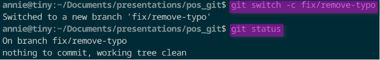
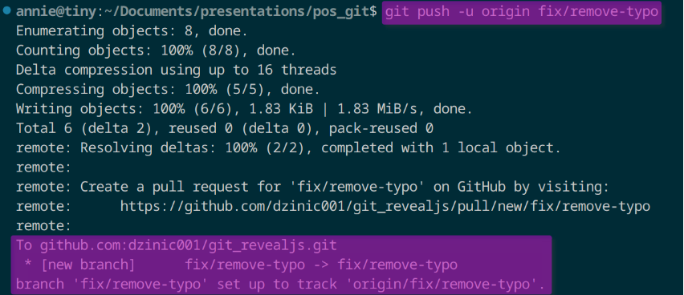
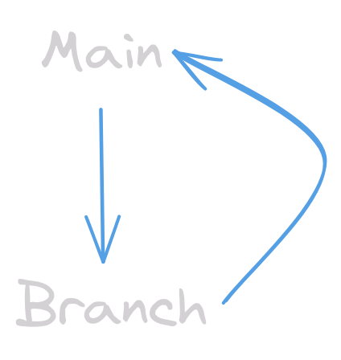

<h1 align="center">Versionierung</h1>

## Hauptaufgaben

- Protokollierung
- Wiederherstellung
- Archivierung

## Arten von Versionssystemen

- Lokale Versionsverwaltung
- Zentrale Versionsverwaltung
- Verteilte Versionsverwaltung

## Github

- Entwickelt: 2008
- Sitz: USA
- Betreiber: Microsoft (seit 2018)
- Benutzer: 83 Milionen
- Über 200 Millionen Repositories (stand 2022)

## Git Cheatsheet

### Basics

| Kommando                    | Beschreibung                                                                                                                                                                                                            |
| --------------------------- | ----------------------------------------------------------------------------------------------------------------------------------------------------------------------------------------------------------------------- |
| `git init <directory>`      | Erstellt leeres Git repo in spezifiziertem Ordner. Ohne Argument wird der Ordner in dem man sich befindet zum git repo                                                                                                  |
| `git clone <clone>`         | Erstellt lokale Kopie des angegebenen repos (z.B. ein repo auf github).                                                                                                                                                 |
| `git add <directory>`       | Alle Veränderungen des momentanten Ordners werden in den staging Bereich verschoben d.h. sie werden beim nächsten `commit` inkludiert. Ersetzt man `<directory>` durch `<file>` wird nur die genannte Datei hinzugefügt |
| `git commit -m "<message>"` | Die Veränderungen im staging Bereich werden in einem Commit zusammengefasst, der durch die `<message>` beschrieben wird. Es soll kurz und bündig beschrieben werden was mit diesem Commit verändert wird.               |
| `git status`                | Listet auf welche Dateien im staging Bereich sind und welche nicht (unstaged) bzw. welche nicht aufgezeichnet werden (untracked)                                                                                        |

### Branching

| Kommando                 | Beschreibung                                                                                                                                                          |
| ------------------------ | --------------------------------------------------------------------------------------------------------------------------------------------------------------------- |
| `git branch`             | Ohne weiteres Argument listet dieser Befehl alle Branches im repo. Fügt man `<branch>` hinzu dann wird ein neuer branch mit dem eingegebenen Namen erstellt           |
| `git switch -c <branch>` | Erstellt einen neuen Branch und wechselt zu diesem Branch im gleichen Befehl. Ohne die `-c` flag wechselt man einfach zu einem existierendem Branch desselben Namens. |
| `git merge <branch>`     | Führt einen merge zwischen dem genannten Branch und dem momentanen Branch aus.                                                                                        |

## 

**Nota Bene:** Man kann anstelle von `git switch` auch den älteren Befehl `git checkout` verwenden. Will man mit `git checkout` einen neuen Branch erstellen und zu diesem wechseln muss man die `-b` flag anhängen. Obwohl `git switch` in der [Dokumentation](https://git-scm.com/docs/git-switch#_description) noch als experimentell gehandelt wird, gibt es eine klare [Empfehlung](https://medium.com/@umar.bwn/git-switch-vs-checkout-understanding-the-differences-and-best-practices-f421c232379c) `git switch` zu verwenden, weil es als sicherer gilt. Mehr dazu [hier](https://medium.com/@umar.bwn/git-switch-vs-checkout-understanding-the-differences-and-best-practices-f421c232379c).

---

### Push & Pull

| Kommando                     | Beschreibung                                                                                                                                                                                                                                                                                                                                                                                                                                                                 |
| ---------------------------- | ---------------------------------------------------------------------------------------------------------------------------------------------------------------------------------------------------------------------------------------------------------------------------------------------------------------------------------------------------------------------------------------------------------------------------------------------------------------------------- |
| `git fetch`                  | Holt bestehende Veränderungen von einem remote repository, verändert aber noch nicht die lokalen Daten                                                                                                                                                                                                                                                                                                                                                                       |
| `git pull`                   | Führt `git fetch` und `git merge` in einem Befehl aus das heißt bestehende Veränderungen werden vom remote repo geholt und auf den lokalen Datenbestand angewendet. Kann alternativ auch mit der `--rebase` flag verwendet werden um lokal einen Rebase statt einem Merge auszuführen um die Branches zu verbinden.                                                                                                                                                          |
| `git push <remote> <branch>` | Führt einen Push auf das remote repository aus d.h. die lokalen Veränderungen die committed worden sind werden "hochgeladen". Gibt es den Branch im remote repo noch nicht wird er hiermit auch erstellt. Es bietet sich an die `-u` flag zu inkludieren (kurz für [`--set-upstream`](https://git-scm.com/docs/git-push#Documentation/git-push.txt---set-upstream)) um eine tracking Referenz zu erstellen, die in Folge ein argumentloses `git push` und `git pull` erlaubt |

## 

### Code Collaboration

## 

**Main:** stabiler Code, deployable

**Branch:** alles was Main verändert

### Pull Request

informiert über die Veränderungen, die im Code vorgenommen worden sind und gibt sie zur Review frei. Weitere Commits können zu einem Pull Request hinzugefügt werden bevor die Änderungen in den Base Branch übernommen werden.

Ein Pull Request auf Github umfasst unter anderem:

- Zusammenfassung der vorgeschlagenen Veränderungen
- Optionen für Kommentare und Änderungsvorschläge
- chronologische Liste der Commits die mit dem PR verbunden sind
- die genaue Übersicht über die Dateien die verändert wurden und wie sie verändert wurden

### Quellen

<section>
            <ul
              style="
                list-style: none;
                display: flex;
                flex-direction: column;
                gap: 10px;
              "
            >
              <li>
                Wikipedia-Autoren. (2023, 22. Oktober). GitHub. In Wikipedia –
                Die freie Enzyklopädie.
                <a
                  href="https://de.wikipedia.org/w/index.php?title=GitHub&oldid=238396332"
                  >https://de.wikipedia.org/w/index.php?title=GitHub&oldid=238396332</a
                >
              </li>
              <li>
                Senarclens de Grancy, G. (n.d.) Git. In: DVC.
                <a
                  href="https://www.senarclens.eu/~gerald/presentations/dvc/#(6)"
                  >https://www.senarclens.eu/~gerald/presentations/dvc/#(6)</a
                >
              </li>
              <li>
                Wikipedia-Autoren. (2022, 24. September). Versionsverwaltung. In
                Wikipedia – Die freie Enzyklopädie.
                <a
                  href="https://de.wikipedia.org/w/index.php?title=Versionsverwaltung&oldid=226425173"
                  >https://de.wikipedia.org/w/index.php?title=Versionsverwaltung&oldid=226425173</a
                >
              </li>
             <li>
                Confreaks. (2012, Jänner 18). How GitHub Uses GitHub to Build
                GitHub by Zach Holman [Video]. YouTube.
                <a href="https://youtu.be/qyz3jkOBbQY?si=iXhgmaJH9qAvB0Kl"
                  >https://youtu.be/qyz3jkOBbQY?si=iXhgmaJH9qAvB0Kl</a
                >
              </li>
              <li>
                Cottle, P. (2023). learnGitBranching. Github.
                <a href="https://github.com/pcottle/learnGitBranching"
                  >https://github.com/pcottle/learnGitBranching</a
                >
              </li>
              <li>
                Chacon, S., & Straub, B. (2014). 3.2 Git Branching - Einfaches
                Branching und Merging. In Pro Git. Apress.<a
                  href="https://git-scm.com/book/de/v2/Git-Branching-Einfaches-Branching-und-Merging"
                  >https://git-scm.com/book/de/v2/Git-Branching-Einfaches-Branching-und-Merging</a
                >
              </li>
              <li>
                Chacon, S., & Straub, B. (2014). 6.2 GitHub - Mitwirken an einem
                Projekt. In Pro Git. Apress.<a
                  href="https://git-scm.com/book/de/v2/GitHub-Mitwirken-an-einem-Projekt"
                  >https://git-scm.com/book/de/v2/GitHub-Mitwirken-an-einem-Projekt</a
                >
              </li>
              <li>
                About Pull Requests. (n.d.). GitHub Docs.
                <a
                  href="https://docs.github.com/en/pull-requests/collaborating-with-pull-requests/proposing-changes-to-your-work-with-pull-requests/about-pull-requests"
                  >https://docs.github.com/en/pull-requests/collaborating-with-pull-requests/proposing-changes-to-your-work-with-pull-requests/about-pull-requests</a
                >
              </li>
            </ul>

### Made with

  
    
  
  

---

  MIT licensed | Copyright © 2011-2023 Hakim El Hattab, https://hakim.se

